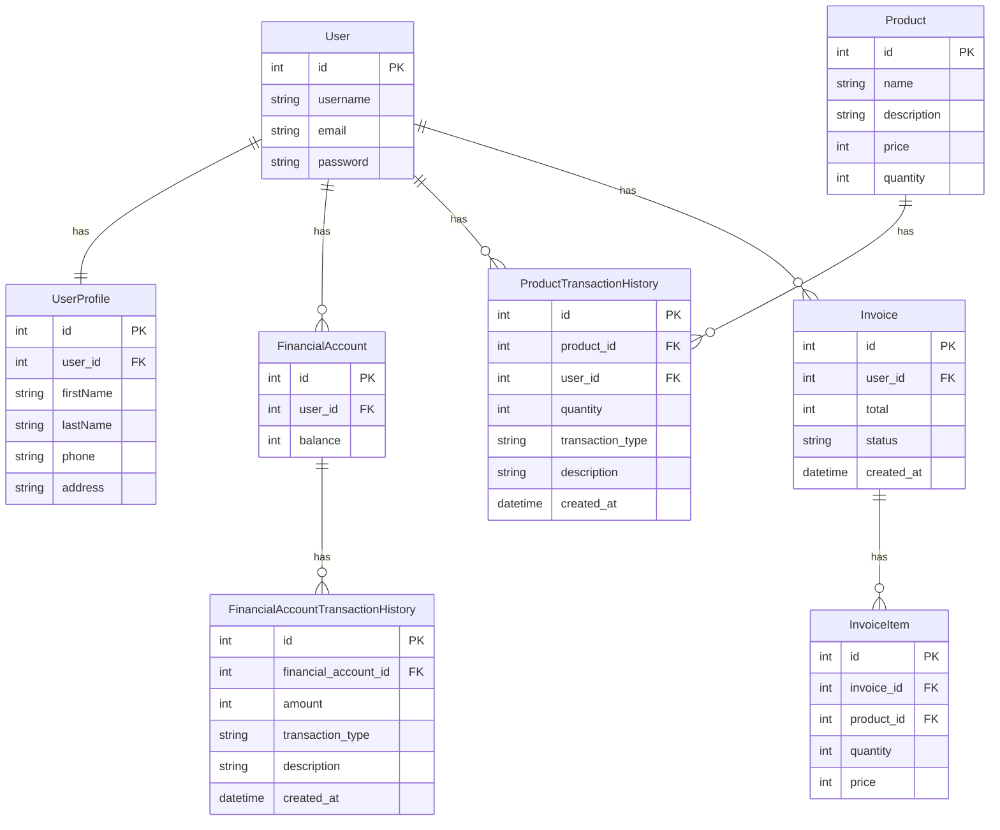

# sika-backend

## Entity Relationship Diagram

```mermaid

erDiagram
  User {
    int id PK
    string username
    string email
    string password
  }
  
  UserProfile {
    int id PK
    int user_id FK
    string firstName
    string lastName
    string phone
    string address
  }
  
  FinancialAccount {
    int id PK
    int user_id FK
    int balance
  }

  FinancialAccountTransactionHistory {
    int id PK
    int financial_account_id FK
    int amount
    string transaction_type
    string description
    datetime created_at
  }


  Product {
    int id PK
    string name
    string description
    int price
    int quantity
  }

  ProductTransactionHistory {
    int id PK
    int product_id FK
    int user_id FK
    int quantity
    string transaction_type
    string description
    datetime created_at
  }
  
  Invoice {
    int id PK
    int user_id FK
    int total
    string status
    datetime created_at
  }

  InvoiceItem {
    int id PK
    int invoice_id FK
    int product_id FK
    int quantity
    int price
  }


  User ||--|| UserProfile: has
  User ||--o{ FinancialAccount: has
  FinancialAccount ||--o{ FinancialAccountTransactionHistory: has
  Product ||--o{ ProductTransactionHistory: has
  User ||--o{ ProductTransactionHistory: has
  User ||--o{ Invoice: has
  Invoice ||--o{ InvoiceItem: has
```

